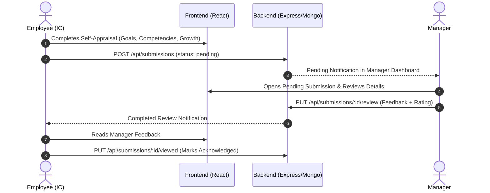

# 🚀 Performance Review System

A full-stack performance appraisal and review management platform designed to streamline periodic evaluation cycles between **Individual Contributors (Employees)** and **Managers**.

---

## 📖 Table of Contents
- [Overview](#-overview)
- [Key Features](#-key-features)
- [Tech Stack](#-tech-stack)
- [Project Architecture](#-project-architecture)
- [Directory Structure](#-directory-structure)
- [Getting Started](#-getting-started)
  - [Prerequisites](#prerequisites)
  - [1. Backend Setup](#1-backend-setup)
  - [2. Frontend Setup](#2-frontend-setup)
- [Environment Variables](#-environment-variables)
- [API Reference](#-api-reference)
- [User Roles & Workflow](#-user-roles--workflow)
- [Roadmap](#-roadmap)

---

## 🌟 Overview

The **Performance Review System** provides an intuitive, end-to-end appraisal workflow for teams. Employees can conduct structured self-evaluations (scoring competencies, tracking goal milestones, highlighting growth areas, and self-ratings), while Managers can review pending appraisals, provide quantitative ratings, and add actionable managerial feedback.

---

## ✨ Key Features

### 👤 For Individual Contributors (IC / Senior IC)
- **Comprehensive Self-Appraisal Form**:
  - **Employee Details**: Name, role, department, review period.
  - **Goals & OKRs**: Add custom goals, track percentage progress, and document milestones.
  - **Competencies Matrix**: 1–5 scale ratings across technical and interpersonal skills.
  - **Growth & Development**: Document strengths, areas for improvement, and career development goals.
  - **Self-Evaluation**: Narrative reflection on accomplishments, challenges, learnings, and future goals.
  - **Overall Self-Rating**: Final self-assessment score.
- **Submission History**: Track status (`pending`, `reviewed`, `approved`, `rejected`).
- **Manager Feedback Review**: View detailed manager scores and commentary, with an acknowledgment mechanism ("Mark as Viewed").

### 👔 For Managers
- **Pending Reviews Dashboard**: Real-time list of all awaiting appraisals submitted by team members.
- **Evaluation Modal**: Detailed modal to inspect the employee's self-evaluation breakdown.
- **Official Manager Review**: Submit formal ratings (1–5 scale) and qualitative feedback notes.

### 🔔 System-Wide
- **Role-Based Authentication**: Secure JWT-based registration and login for different roles.
- **Live Notification Hub**: Unread counters and notifications for pending appraisals (managers) and completed reviews (employees).
- **Responsive & Modern UI**: Built with React 19, Lucide React icons, and tailored CSS design system.

---

## 🛠️ Tech Stack

### **Frontend**
- **Framework**: [React 19](https://react.dev/) + [Vite](https://vitejs.dev/)
- **Icons**: [Lucide React](https://lucide.dev/)
- **Styling**: Vanilla CSS (Modular design tokens & responsive components)
- **HTTP Client**: Native Fetch API with JWT Authorization

### **Backend**
- **Runtime**: [Node.js](https://nodejs.org/) (ES Modules)
- **Framework**: [Express 5](https://expressjs.com/)
- **Database**: [MongoDB](https://www.mongodb.com/) via [Mongoose 9](https://mongoosejs.com/)
- **Authentication**: JSON Web Tokens (`jsonwebtoken`) & `bcryptjs`
- **Security & Logging**: `helmet`, `cors`, `express-rate-limit`, `morgan`, and `winston`

---

## 📁 Directory Structure

```text
performance_review/
├── Backend/
│   ├── src/
│   │   ├── config/          # Database connection & configurations
│   │   ├── controllers/     # Request handlers (auth, submissions, reviews)
│   │   ├── middleware/      # Auth verification, rate limiting, validation
│   │   ├── models/          # Mongoose schemas (User, Submission, Review)
│   │   ├── routes/          # API route definitions
│   │   ├── services/        # Business logic services
│   │   ├── utils/           # Helper utilities & loggers
│   │   ├── app.js           # Express app configuration & middleware pipeline
│   │   └── server.js        # Server listener entry point
│   ├── .env                 # Backend environment variables
│   └── package.json
│
├── Frontend/
│   ├── public/              # Static assets
│   ├── src/
│   │   ├── api/             # API client functions (auth, submissionApi, reviewApi)
│   │   ├── components/      # UI components (Header, SubmissionsList, Modals, Forms)
│   │   ├── config/          # API endpoint configurations
│   │   ├── styles/          # Modular CSS stylesheets
│   │   ├── App.jsx          # Main application component & state router
│   │   ├── main.jsx         # React application root entry point
│   │   └── App.css          # App-level styling
│   ├── .env                 # Frontend local environment variables
│   ├── .env.production      # Production environment configuration
│   ├── index.html           # HTML template
│   ├── vite.config.js       # Vite configuration
│   └── package.json
└── README.md
```

---

## 🚀 Getting Started

### Prerequisites
- [Node.js](https://nodejs.org/) (v18+ recommended)
- [MongoDB](https://www.mongodb.com/) instance (local or MongoDB Atlas connection string)
- npm or yarn

---

### 1. Backend Setup

1. Open a terminal and navigate to the `Backend` directory:
   ```bash
   cd Backend
   ```

2. Install dependencies:
   ```bash
   npm install
   ```

3. Create a `.env` file in the `Backend` root (see [Environment Variables](#-environment-variables)).

4. Start the development server:
   ```bash
   npm run dev
   ```
   *The backend will run on `http://localhost:5000` by default.*

---

### 2. Frontend Setup

1. Open a separate terminal and navigate to the `Frontend` directory:
   ```bash
   cd Frontend
   ```

2. Install dependencies:
   ```bash
   npm install
   ```

3. Configure your `.env` file:
   ```env
   VITE_API_BASE_URL=http://localhost:5000
   ```

4. Start the Vite development server:
   ```bash
   npm run dev
   ```
   *The frontend will run on `http://localhost:5173`.*

---

## 🔐 Environment Variables

### Backend (`Backend/.env`)
```env
PORT=5000
MONGO_URI=mongodb+srv://<username>:<password>@cluster.mongodb.net/<dbname>
FRONTEND_URL=http://localhost:5173
JWT_SECRET=your_super_secret_jwt_key
NODE_ENV=development
```

### Frontend (`Frontend/.env`)
```env
VITE_API_BASE_URL=http://localhost:5000
```

---

## 📡 API Reference

### **Authentication (`/api/auth`)**
| Method | Endpoint | Description | Access |
|---|---|---|---|
| `POST` | `/api/auth/register` | Register a new user | Public |
| `POST` | `/api/auth/login` | Log in and receive JWT token | Public |
| `GET` | `/api/auth/me` | Fetch logged-in user profile | Authenticated |

### **Submissions (`/api/submissions`)**
| Method | Endpoint | Description | Access |
|---|---|---|---|
| `POST` | `/api/submissions` | Create a new performance review submission | IC / Employee |
| `GET` | `/api/submissions/my-submissions` | List all submissions by current user | IC / Employee |
| `GET` | `/api/submissions/pending` | List all pending review submissions | Manager |
| `GET` | `/api/submissions/:id` | Get details of a single submission | Authenticated |
| `PUT` | `/api/submissions/:id/review` | Submit manager feedback and rating | Manager |
| `PUT` | `/api/submissions/:id/viewed` | Mark reviewed submission as viewed | IC / Employee |

---

## 🔄 User Roles & Workflow



---

## 🗺️ Roadmap

- [ ] **Export to PDF**: Generate downloadable PDF summary reports for archived reviews.
- [ ] **Timesheet Module**: Integrated work hour tracking.
- [ ] **Tasks Module**: Sprint and deliverable task board linked to review goals.
- [ ] **Expense Management**: Expense logging and approval tracking.
- [ ] **Analytics & Reporting**: Department-wide performance charts and trend analysis.

---

## 📄 License

This project is licensed under the [ISC License](LICENSE).
